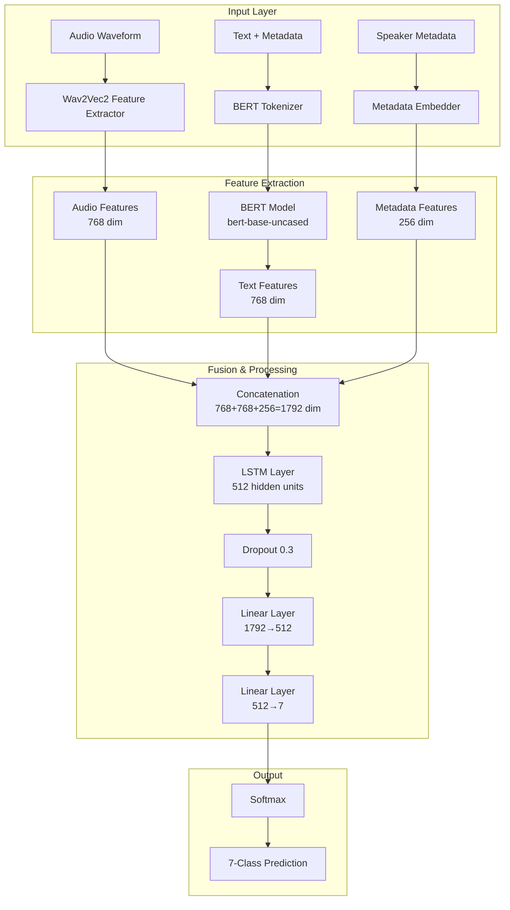
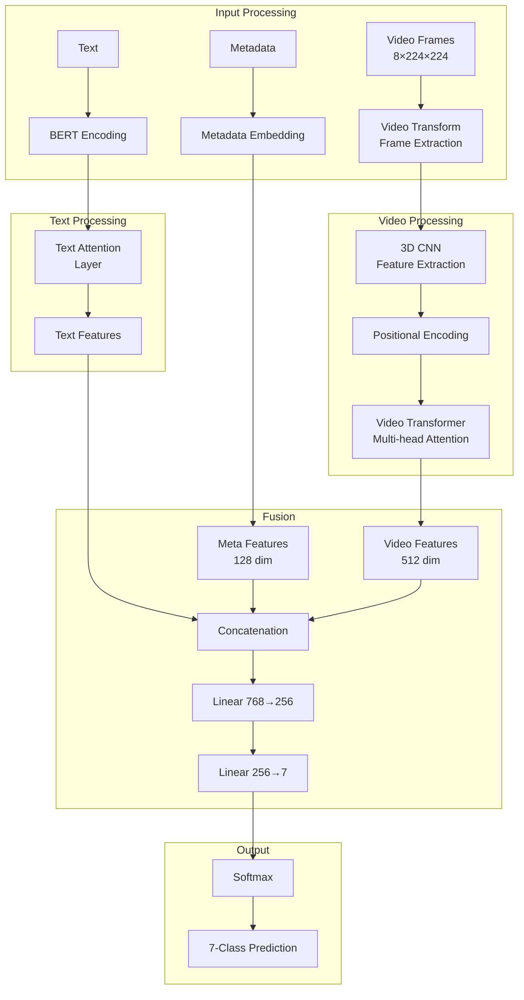
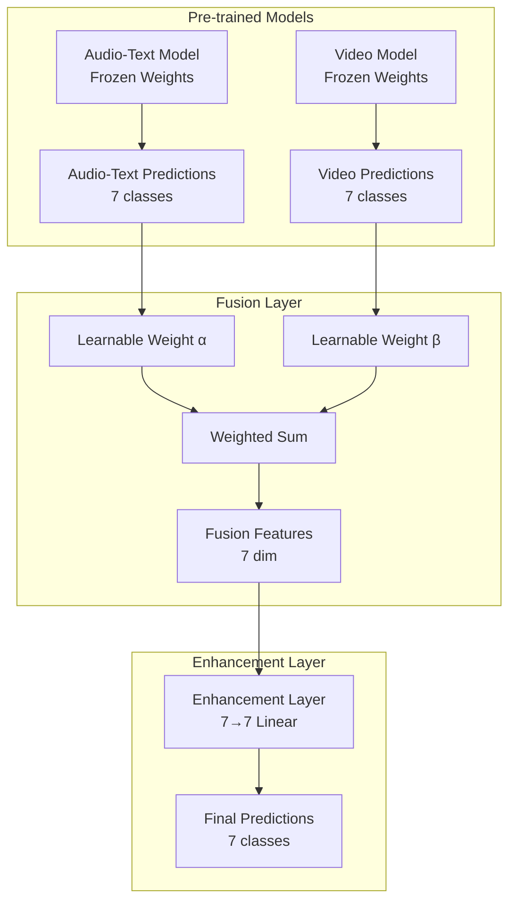
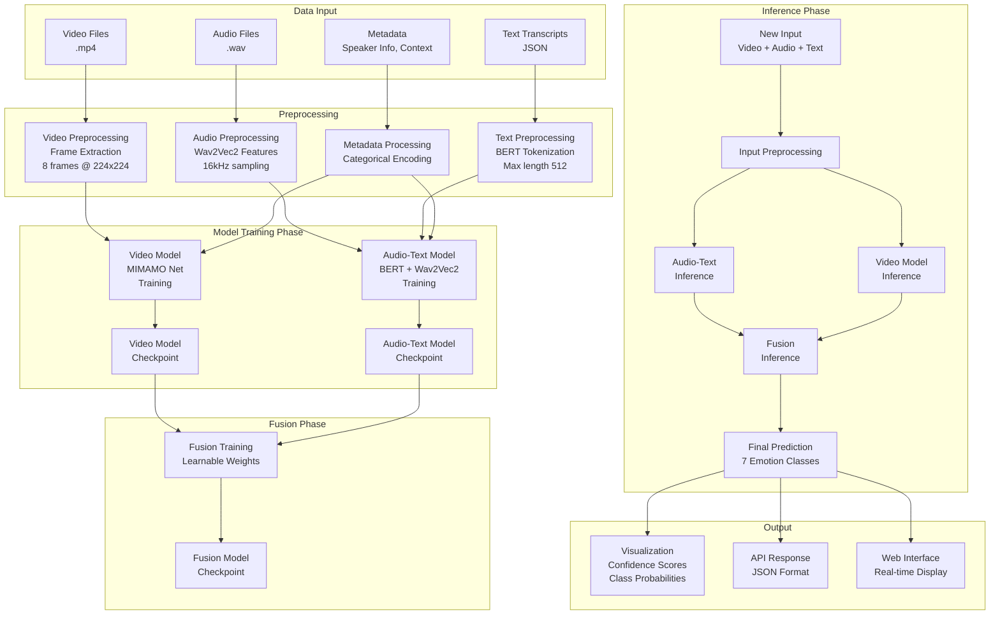

# Methodology: Multimodal Emotion Recognition System

## Overview
This project implements a comprehensive multimodal emotion recognition system that combines three distinct deep learning models to classify emotions across seven categories: **neutral, joy, sadness, anger, fear, disgust, and surprise**. The system employs a novel approach of training individual modality-specific models and then fusing their predictions through learnable weighted fusion.

## Model Architectures

### 1. Audio-Text Multimodal Model (Best Performer: 83.15% accuracy)

#### Architecture Overview
The Audio-Text model combines BERT-based text processing with Wav2Vec2 audio feature extraction and sequential LSTM processing for dialogue history understanding.



#### Key Equations

**Feature Concatenation:**
$$\mathbf{f}_{combined} = \text{Concat}(\mathbf{f}_{audio}, \mathbf{f}_{text}, \mathbf{f}_{metadata})$$

**LSTM Processing:**
$$\mathbf{h}_t, \mathbf{c}_t = \text{LSTM}(\mathbf{f}_{combined}, \mathbf{h}_{t-1}, \mathbf{c}_{t-1})$$

**Final Classification:**
$$P(y = c|\mathbf{x}) = \text{Softmax}(W_2 \cdot \text{ReLU}(W_1 \cdot \mathbf{h}_t + b_1) + b_2)$$

where:
- $\mathbf{f}_{audio} \in \mathbb{R}^{768}$ - Wav2Vec2 audio features
- $\mathbf{f}_{text} \in \mathbb{R}^{768}$ - BERT text features
- $\mathbf{f}_{metadata} \in \mathbb{R}^{256}$ - Metadata embeddings
- $\mathbf{h}_t \in \mathbb{R}^{512}$ - LSTM hidden state

#### Algorithm: Audio-Text Model Training
```
Algorithm 1: Audio-Text Multimodal Training
Input: Audio files A, Text transcripts T, Metadata M, Labels Y
Output: Trained model θ*

1: Initialize BERT, Wav2Vec2 models (frozen)
2: Initialize LSTM, linear layers θ
3: for epoch = 1 to max_epochs do
4:    for batch in DataLoader do
5:        # Feature Extraction
6:        f_audio = Wav2Vec2(A)
7:        f_text = BERT(T)
8:        f_meta = MetadataEmbedder(M)
9:        
10:       # Fusion
11:       f_combined = Concat(f_audio, f_text, f_meta)
12:       
13:       # Sequential Processing
14:       h, c = LSTM(f_combined)
15:       
16:       # Classification
17:       logits = Linear2(ReLU(Linear1(h)))
18:       loss = CrossEntropy(logits, Y)
19:       
20:       # Optimization
21:       loss.backward()
22:       optimizer.step()
23:    end for
24: end for
25: return θ*
```

### 2. Video Model - MIMAMO Net (72.24% accuracy)

#### Architecture Overview
The MIMAMO Net (Modality-Invariant Multi-Modal Attention Network) processes video frames through a Video Transformer architecture with integrated text processing.



#### Key Equations

**Multi-Head Attention for Video:**
$$\text{Attention}(Q, K, V) = \text{Softmax}\left(\frac{QK^T}{\sqrt{d_k}}\right)V$$

**Video Transformer Block:**
$$\mathbf{z}_l = \text{LayerNorm}(\mathbf{x}_l + \text{MultiHeadAttn}(\mathbf{x}_l))$$
$$\mathbf{x}_{l+1} = \text{LayerNorm}(\mathbf{z}_l + \text{FFN}(\mathbf{z}_l))$$

**Temporal Aggregation:**
$$\mathbf{v}_{global} = \frac{1}{T} \sum_{t=1}^{T} \mathbf{v}_t$$

where:
- $T = 8$ frames per video
- $\mathbf{v}_t \in \mathbb{R}^{512}$ - frame-level features

### 3. Deep Fusion Model (Enhanced Late Fusion: 58.04% accuracy)

#### Architecture Overview
The Deep Fusion model combines predictions from pre-trained Audio-Text and Video models using learnable weighted fusion with only 9 trainable parameters.



#### Key Equations

**Learnable Weighted Fusion:**
$$\mathbf{p}_{fused} = \alpha \cdot \mathbf{p}_{audio\text{-}text} + \beta \cdot \mathbf{p}_{video}$$

**Normalization Constraint:**
$$\alpha + \beta = 1, \quad \alpha, \beta \geq 0$$

**Enhancement Layer:**
$$\mathbf{p}_{final} = \text{Softmax}(W_{enhance} \cdot \mathbf{p}_{fused} + b_{enhance})$$

**Total Parameters:** 9 (2 weights + 7×1 enhancement layer)

#### Algorithm: Deep Fusion Training
```
Algorithm 2: Deep Fusion Model Training
Input: Pre-trained models θ_AT, θ_V, Training data D
Output: Fusion weights α, β, enhancement layer W_e

1: Freeze θ_AT and θ_V
2: Initialize α = 0.5, β = 0.5
3: Initialize W_e ∈ R^{7×7}, b_e ∈ R^7
4: for epoch = 1 to max_epochs do
5:    for batch in D do
6:        # Get predictions from frozen models
7:        p_AT = Model_AT(x_audio, x_text)
8:        p_V = Model_V(x_video, x_text)
9:        
10:       # Weighted fusion
11:       p_fused = α * p_AT + β * p_V
12:       
13:       # Enhancement
14:       p_final = Softmax(W_e @ p_fused + b_e)
15:       
16:       # Loss computation
17:       loss = CrossEntropy(p_final, y_true)
18:       
19:       # Update only fusion parameters
20:       loss.backward()
21:       update(α, β, W_e, b_e)
22:       
23:       # Ensure weight constraint
24:       normalize(α, β) such that α + β = 1
25:    end for
26: end for
27: return α*, β*, W_e*, b_e*
```

## System Flowchart



## Training Strategy

### Loss Functions

**Cross-Entropy Loss for Classification:**
$$\mathcal{L}_{CE} = -\sum_{i=1}^{N} \sum_{c=1}^{7} y_{i,c} \log(\hat{y}_{i,c})$$

**Weighted Cross-Entropy for Class Imbalance:**
$$\mathcal{L}_{weighted} = -\sum_{i=1}^{N} \sum_{c=1}^{7} w_c \cdot y_{i,c} \log(\hat{y}_{i,c})$$

where $w_c$ are class weights computed as:
$$w_c = \frac{n_{samples}}{7 \cdot n_{samples\_class\_c}}$$

### Optimization Strategy

**Learning Rate Schedule:**
- Initial learning rate: $lr_0 = 5 \times 10^{-5}$
- Linear warmup followed by cosine decay
- Warmup steps: 10% of total steps

**Regularization:**
- Dropout: 0.3 for all models
- Weight decay: $1 \times 10^{-5}$
- Early stopping: patience = 7 epochs

### Performance Evaluation

**Metrics:**
- **Accuracy:** Overall classification accuracy
- **Precision:** $P_c = \frac{TP_c}{TP_c + FP_c}$
- **Recall:** $R_c = \frac{TP_c}{TP_c + FN_c}$
- **F1-Score:** $F1_c = 2 \cdot \frac{P_c \cdot R_c}{P_c + R_c}$
- **Macro-averaged F1:** $F1_{macro} = \frac{1}{7} \sum_{c=1}^{7} F1_c$

## Results Summary

| Model | Architecture | Test Accuracy | Parameters | Key Innovation |
|-------|-------------|---------------|------------|----------------|
| **Audio-Text** | BERT + Wav2Vec2 + LSTM | **83.15%** | 110M+ | Multimodal feature fusion with metadata |
| **Video** | MIMAMO Net + Transformer | **72.24%** | 25M+ | Video attention with text integration |
| **Deep Fusion** | Learnable weighted fusion | **58.04%** | **9** | Minimal parameter fusion strategy |
| **Late Fusion** | Simple weighted average | **60.42%** | 0 | Parameter-free baseline |

## Technical Implementation Details

### Hardware Requirements
- **GPU:** NVIDIA RTX 3060 12GB (minimum)
- **RAM:** 16GB+ system memory
- **Storage:** 50GB+ for dataset and checkpoints

### Software Dependencies
- **PyTorch:** 2.4.0+
- **Transformers:** 4.21.0+
- **OpenCV:** Computer vision operations
- **Librosa:** Audio processing
- **Scikit-learn:** Evaluation metrics

### Training Time
- **Audio-Text Model:** ~4-6 hours per epoch
- **Video Model:** ~2-3 hours per epoch  
- **Fusion Model:** ~30 minutes total training

This methodology demonstrates a comprehensive approach to multimodal emotion recognition, combining state-of-the-art architectures with innovative fusion strategies to achieve robust performance across different input modalities.
